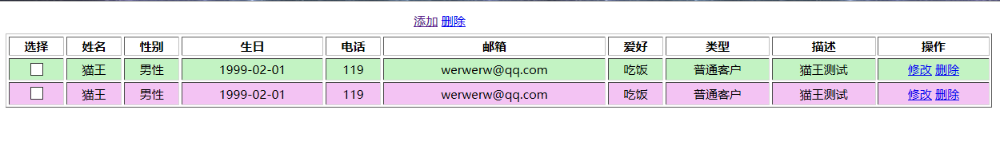
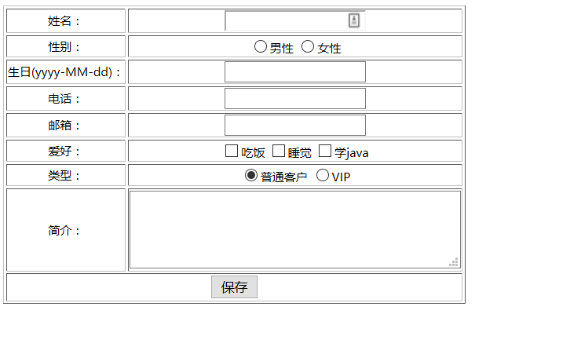

##Servlet与JSP使用JDBC实现客户管理系统的增删改查


截图：

主页面（listCustomer.jsp）：



 
添加客户页面(addCustomer.jsp)：



#关键点

1. 
<a>标签的href属性可以直接设置javascrpit函数，JSP中如下：
 ```
	<a href="javascript:delOne('${c.id}')">删除</a>

 ```

这样方便直接通过java代码来设置js函数的参数值，这样就避免了从html中获取删除条目的id值，也省去了写onClick属性的麻烦。


2. 
对于批量删除的时候，如何批量获取和上传id的问题，见listCustomer.jsp页面

这里采用了form表单的形式来上传 所选的多个id值。这样就不需要用js代码手动获取所有的id值了，省时省力，指的借鉴。


3. 
表单提交的问题引出的问题！！
何时使用重定向（redirect），何时使用请求转发（forward）

虽然使用请求转发(forward)将浏览器转向了另一个页面，但是浏览器的地址栏还是显示原先的地址。
注意：比如我们在通过页面向数据库中添加一条新的记录，如果我们使用请求转发，则url地址还是没变的，此时如果用户刷新当前页面，则又会重复执行一次。而如果使用重定向，则不会有这样的问题。

项目里表单提交（添加用户，修改用户、删除）的时候，在 ControllerServlet中使用了重定向（sendRedirect方法）来避免表单重复提交。

而在仅仅是在查询操作的时候，使用请求转发（getRequestDispatcher("xxx").forward()），这是因为我们需要通过request对象来servlet和jsp之间传递参数。而重定向实际上会发起两次请求，导致Servlet与jsp之间传递参数较为麻烦，当然也可以通过session来传递，但是session共享范围太大，没有request对象适合。

之所以只在查询操作的时候使用forward，是因为查询操作不会修改数据库，即使是重复查询也没任何影响。而增删改三个操作都会修改数据库，所以出现重复提交就会修改数据库数据，不安全。


4. getContextPath()导致的问题
见 [《jsp中相对路径${pageContext.request.contextPath} 与绝对路径（RealPath）的区别及bug》](http://www.dabu.info/jsp-servlet-contextpath-realpath-different-bug.html)


因为我们的web项目是在网站的根目录，所以getContextPath()返回的是""  。 在jsp/servlet中，当我们请求转发或重定向的时候，如果跳转或重定向的url是空字符串，那么，默认跳转或重定向到当前请求的url。